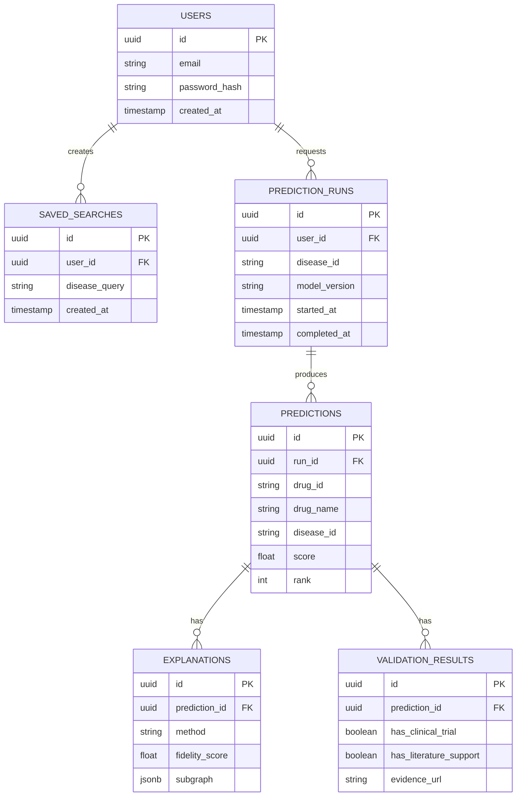

# CuroVex — Database Schema

CuroVex uses two databases with different jobs: **Neo4j** holds the biomedical knowledge
graph itself (the thing being reasoned over), and **PostgreSQL** holds application state
(the thing the product runs on). They are never merged — this keeps the graph reusable and
the app state simple.

## 1. Neo4j graph schema

### Node labels

| Label | Key properties | Source |
|---|---|---|
| `Drug` | `id`, `name`, `drugbank_id`, `atc_code` | PrimeKG / DRKG |
| `Disease` | `id`, `name`, `mondo_id`, `category` | PrimeKG |
| `Gene` | `id`, `symbol`, `entrez_id` | PrimeKG |
| `Protein` | `id`, `uniprot_id`, `name` | PrimeKG |
| `Pathway` | `id`, `name`, `reactome_id` | PrimeKG |
| `SideEffect` | `id`, `name`, `meddra_id` | PrimeKG |

### Relationship types

| Type | From → To | Properties |
|---|---|---|
| `TREATS` | `Drug → Disease` | `source`, `confidence` |
| `TARGETS` | `Drug → Protein` | `mechanism`, `affinity` |
| `ASSOCIATED_WITH` | `Gene → Disease` | `evidence_score` |
| `PART_OF_PATHWAY` | `Gene/Protein → Pathway` | — |
| `CAUSES_SIDE_EFFECT` | `Drug → SideEffect` | `frequency` |
| `INTERACTS_WITH` | `Protein → Protein` | `interaction_type` |
| `PREDICTED_TREATS` | `Drug → Disease` | `score`, `model_version`, `generated_at` — **written by CuroVex, not sourced from PrimeKG** |

`PREDICTED_TREATS` is the output relationship the model writes back into the graph, kept
distinct from the ground-truth `TREATS` edges so provenance is always clear.

## 2. PostgreSQL application schema

### Notes
- `EXPLANATIONS.method` is either `path_based` or `counterfactual` — the same prediction can
  have both, which is what makes the comparison study (XAI-3/XAI-4 in the backlog) possible.
- `EXPLANATIONS.subgraph` stores the explanation subgraph as JSON (node/edge IDs) so the
  frontend can re-render it without re-querying Neo4j on every page load.
- No patient data, no PII beyond account email — this schema was deliberately kept clear of
  anything that would need an ethics board.
