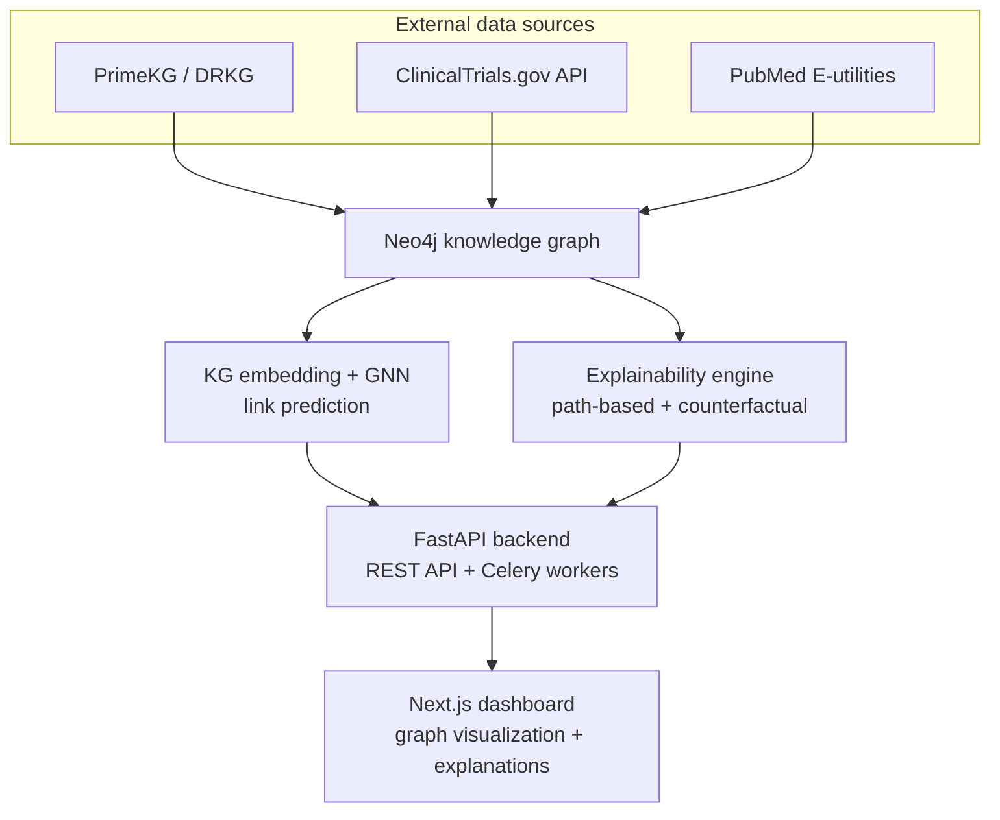

# CuroVex — System Architecture

**Explainable AI Framework for Drug Repurposing Using Biomedical Knowledge Graphs**

## 1. Overview

CuroVex predicts new therapeutic uses for existing drugs by reasoning over a biomedical
knowledge graph (KG), then explains *why* it made each prediction using two methods:
a conventional path-based explanation (baseline) and a **counterfactual edge-masking**
explanation (novel contribution) that tests whether the explanation actually holds up —
by removing the evidence and checking whether the prediction breaks.

The system is organized into six layers. Data flows bottom-up from public sources through
the graph, the model, and the explainability engine, then out through the API to the
dashboard.



## 2. Layer breakdown

### 2.1 Data layer
- **Sources:** PrimeKG (primary — ~4M relations across drugs, diseases, genes, proteins,
  pathways) and DRKG (secondary, used for cross-validation of predicted pairs).
- **Ingestion:** Python ETL scripts normalize node/relation schemas from both sources into
  one unified graph, versioned as dated snapshots so experiments are reproducible.
- **Storage:** Neo4j (Community Edition, Dockerized). Chosen over a relational store because
  the explainability engine needs native multi-hop traversal (`MATCH` path queries) that
  would be painful and slow in SQL.

### 2.2 ML / prediction layer
- **Embeddings:** PyKEEN benchmarks TransE, RotatE, ComplEx, and DistMult on the KG; the
  best performer by AUPRC on a held-out split is promoted to production.
- **Link prediction:** a Graph Attention Network (GAT, via PyTorch Geometric) scores
  candidate drug–disease pairs using the learned embeddings plus local graph structure.
- **Serving:** the trained model is exported (TorchScript) and loaded once by the API
  process at startup — no per-request retraining.

### 2.3 Explainability layer (the novelty gap)
- **Baseline — path-based reasoning:** extracts meta-paths connecting a drug to a disease
  (e.g. drug → target gene → pathway → disease) and ranks them by relevance. This mirrors
  what XAIPath, XG4Repo, and similar 2025–2026 papers already do.
- **Novel — counterfactual edge-masking:** for a given prediction, the engine masks one
  graph edge at a time, re-runs the model, and measures the resulting score drop
  (*fidelity*). Edges whose removal collapses the prediction are the ones that actually
  mattered — this is a testable claim about the explanation, not just a plausible-looking
  path. None of the ~15 papers reviewed for this project implement this.
- **Comparison study:** the two methods are benchmarked against each other on fidelity and
  sparsity, which becomes a contribution in the paper/report, not just an engineering
  feature.

### 2.4 Validation layer
- Automated cross-reference of top-ranked drug–disease predictions against
  **ClinicalTrials.gov** (is there already a registered trial for this pair?) and
  **PubMed** (does recent literature mention this pair?). Both are free, scriptable APIs —
  no data-use agreement or ethics approval required.

### 2.5 Backend / API layer
- **FastAPI** serves REST endpoints for predictions, explanations, and validation results.
- **Celery + Redis** handle long-running jobs (batch prediction runs, full-graph
  re-embedding) asynchronously so API requests stay fast.
- **PostgreSQL** stores application state — user accounts, saved searches, prediction/
  explanation audit trail — kept separate from the graph itself.

### 2.6 Frontend layer
- **Next.js 14** (App Router, TypeScript) dashboard.
- **Cytoscape.js** renders the explanation subgraph interactively — click a predicted
  drug, see the reasoning path and the counterfactual fidelity score side by side.
- **Recharts** for fidelity/confidence comparisons across predictions.

## 3. Non-functional characteristics

| Concern | Approach |
|---|---|
| Scalability | Stateless API layer behind Celery workers; Neo4j indexes on node IDs and relation types |
| Security | JWT auth, input validation via Pydantic, no PII (no patient data used anywhere) |
| Reproducibility | Versioned graph snapshots, MLflow experiment tracking, pinned dependency versions |
| Cost | Entire stack runs on free tiers (Neo4j Aura Free, Render/Railway, Vercel) — no institutional approval needed |
| Explainability latency | Counterfactual masking is O(edges in local subgraph), bounded by capping subgraph radius at 2–3 hops |

## 4. Repository structure

```
curovex/
├── kg-pipeline/          # ETL: PrimeKG/DRKG ingestion → Neo4j
├── ml-core/               # PyKEEN embeddings, GAT model, training scripts
├── explainability/        # path-based + counterfactual masking modules
├── validation/            # ClinicalTrials.gov / PubMed cross-reference scripts
├── api/                   # FastAPI app, Celery tasks, Postgres models
├── dashboard/              # Next.js frontend
├── docs/                  # this file + backlog, schema, roadmap, etc.
└── .github/workflows/     # CI/CD
```
